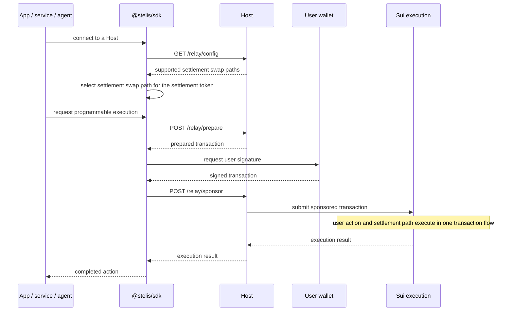

# Stelis

## Value Into Execution

Stelis lets users run programmable Sui transactions with value they already hold.

A user may hold stablecoins, protocol tokens, game tokens, or reusable user-owned credit, but still be blocked when transaction execution requires SUI gas.

Stelis closes that gap by separating execution from settlement. Technically, it is a settlement layer for token-funded transaction execution on Sui.

## A Concrete Flow

A user holds USDC but no SUI.

The user approves an in-app purchase. The app builds its normal Sui transaction. On Sui, that transaction can be a Programmable Transaction Block (PTB).

Stelis sponsors execution with SUI gas, then settles the execution cost and configured fee from the user's USDC through a configured path into SUI.

The user does not need to acquire SUI first. The app does not need to replace its payment, fulfillment, or refund model.

## Execution and Settlement

SUI remains the execution fuel. The user's held value becomes the settlement source for execution cost.

Stelis does not make Sui execution free, and it does not remove SUI from Sui execution. It moves native gas inventory out of the user-facing payment flow.

This also changes the operating model for sponsored transactions. Sponsorship does not have to remain a pure subsidy: the gas payer can provide SUI for execution, then recover the execution cost and configured fee through settlement. That is why usable settlement liquidity matters.

## Liquidity Makes Value Usable

For a held token to become a settlement source for execution cost, it needs a path to settle into SUI.

Stelis uses DeepBook for this path. DeepBook is Sui's on-chain liquidity infrastructure. Stelis does not automatically accept arbitrary tokens. Settlement tokens and DeepBook SUI settlement swap paths are explicitly configured. Each configured path must pass configured pricing, fee, liquidity, and request admission checks.

In this model, liquidity becomes usability infrastructure.

A token with a healthy DeepBook SUI pair can become more than value held in a wallet. It can become a settlement source for app, service, and agent execution.

For token issuers and app developers, this creates a practical incentive. Deeper and more stable SUI liquidity can make a token more useful inside its own product economy.

## Payment Formats Stay Open

Stelis does not define checkout, payment, fulfillment, or refund formats.

Apps can keep their own PTB structure, object model, and business logic. Existing payment SDKs, merchant backends, and external payment protocols can compose with Stelis instead of being replaced by it.

Stelis handles execution-cost settlement underneath those systems. Payment products can focus on their own user experience, while users do not need to manage native gas directly.

## Operating a Host

A Host is a deployed `@stelis/app-api` execution environment that clients connect to. It exposes the Relay API and owns sponsor funding and refill, settlement swap paths, fee policy, and request admission policy.

The Relay API is the `/relay/*` HTTP interface exposed by a Host.

A client connects to a Host. The Host advertises its supported settlement swap paths through `/relay/config`, and the SDK selects the compatible path for the requested settlement token.

The Host execution role is internal to a Host. It appears in settlement fields and implementation names such as `settlementPayoutRecipient`, `executionCostClaim`, `hostFee`, and internal execution flow. Stelis does not present those internal roles as the public product unit.

The Admin app is the tool a Host operator uses to manage Host settings, sponsor state, settlement swap paths, and operating policy.

A developer can connect to an existing Host to start, or operate a Host when their app, protocol, token, settlement swap path, fee policy, or risk policy needs direct control.

## Native to Sui Execution

Stelis implements this model while preserving Sui's execution model.

Programmable Transaction Blocks let user actions and settlement paths be composed in one execution flow. Sponsored gas separates the sender from the gas payer.

Stelis does not require apps to move their business state into a shared Stelis object. App objects remain app-owned, and Stelis composes the settlement path around the app's PTB flow.

A User Vault is a reusable settlement source owned by the user. It preserves the user's asset boundary while giving wallets, apps, services, and agents a way to turn held value into execution capacity.

A User Vault is not a Host balance. The Host cannot treat it as its own liquidity. The vault remains user-owned, and withdrawal authority stays with the user through the vault module.

## Product Entry Points

| Need | Start here | What it is |
| --- | --- | --- |
| Build a dApp or service integration | [`@stelis/sdk`](./packages/sdk/README.md) | Published TypeScript SDK for app and service developers |
| Connect an agent runtime | [`@stelis/mcp-server`](./packages/mcp-server/README.md) | Published Model Context Protocol (MCP) server for agent clients |
| Run a Host API | [`@stelis/app-api`](./packages/app-api/README.md) | Deployable Host runtime exposing Relay API, auth, admin, and promotion HTTP APIs |
| Run the demo web app | [`@stelis/app-web`](./packages/app-web/README.md) | Deployable static demo app for docs, status, playground, and sandbox flows |
| Run the admin web app | [`@stelis/app-admin`](./packages/app-admin/README.md) | Deployable static admin app for Host operators |
| Review or build the Move package | [`packages/contracts/move`](./packages/contracts/move/README.md) | On-chain Move package |

## Documentation

Start with the [documentation map](./docs/index.md).

For user transaction constraints, see [User TransactionKind rules](./docs/api.md#user-transactionkind-rules) and [relay invariants](./docs/invariants.md#relay-policy).

For the package layout, product package policy, and dependency rules, see [repository structure](./docs/repository-structure.md).

## Script Responsibility

Repository-root scripts are for local development, repository checks, and local verification builds.
They are not deployment entrypoints.

Package scripts define each package's own runtime contract:

- `npm run dev:app-api`, `npm run dev:app-web`, and `npm run dev:app-admin`
  are root-level local development helpers. `dev:app-api` always starts an isolated Redis
  memory server for the `app-api` Host.
- `npm test`, `npm run lint`, `npm run typecheck`, `npm run release:check`, and `npm run build`
  are repository verification commands.
- Package `build` scripts create package artifacts.
- Package `start` scripts, where present, run compiled package artifacts and expect environment values
  from the shell, container, or deployment platform.

Platform deployment commands belong in the platform configuration that deploys a product package.
Do not treat root `dev:*` scripts as deployment commands.

## Package Policy

Workspace packages are allowed when they make development safer and clearer. They are not automatically public products.

Published or deployed product packages are limited to one package per product entry point:

- `@stelis/sdk`
- `@stelis/mcp-server`
- `@stelis/app-api`
- `@stelis/app-web`
- `@stelis/app-admin`
- `packages/contracts/move`

Internal packages stay private and hold shared implementation rules:

- `@stelis/contracts`
- `@stelis/core-relay`
- `@stelis/core-api`

The SDK and MCP server are separate products. They must not import or wrap each other.
