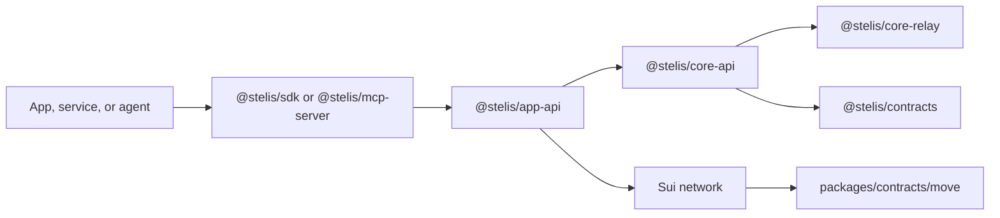

# Architecture

This document is the architecture map for the current repository docs.

## System Flow

## Current Validation Layers

| Layer | Purpose | Main code |
| --- | --- | --- |
| User-command checks | Reject unsafe commands before the Host appends settlement | `core-relay/src/validate/static.ts` |
| Settlement argument checks | Ensure settlement arguments match Host config and on-chain config | `core-relay/src/validate/static.ts` |
| Non-loss checks | Ensure sponsor approval math still holds before signing | `core-relay/src/validate/nonloss.ts` |
| Preflight and submit | Simulate and submit the sponsored transaction | `core-api/src/session` |
| Move checks | Enforce vault, fee, pause, and settlement rules on-chain | `contracts/move/sources` |

## Topic Documents

- [`architecture/onchain-settlement.md`](./architecture/onchain-settlement.md)
- [`architecture/pricing-and-validation.md`](./architecture/pricing-and-validation.md)
- [`architecture/settlement-swap-path-boundaries.md`](./architecture/settlement-swap-path-boundaries.md)
- [`architecture/sponsor-pools.md`](./architecture/sponsor-pools.md)
- [`architecture/prepare-sponsor-session.md`](./architecture/prepare-sponsor-session.md)

## Package Boundary

Package boundaries are documented in [`repository-structure.md`](./repository-structure.md).
