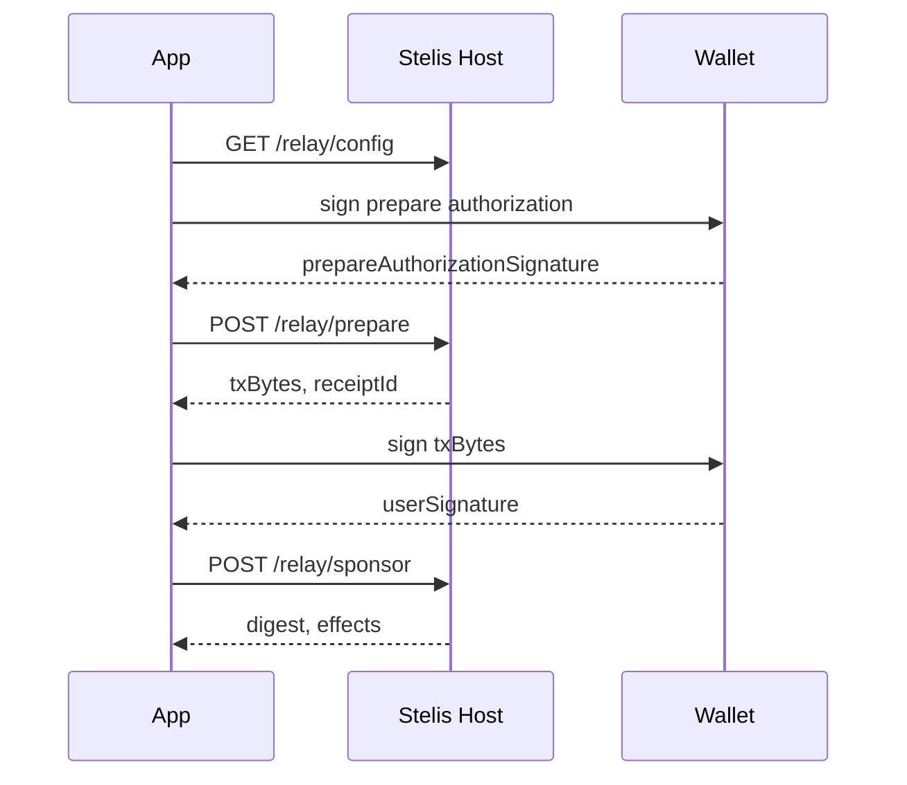

# Integration Flow

This document describes the generic sponsored transaction flow.

## Generic Relay Flow

1. Call `GET /relay/config`.
2. Choose a settlement token from `supportedSettlementSwapPaths`.
3. Build transaction-kind bytes.
4. Hash `txKindBytes` and ask the sender to sign the prepare authorization personal message.
5. Call `POST /relay/prepare` with `txKindBytes`, `senderAddress`, `paymentTokenType`, `txKindBytesHash`, `prepareAuthorizationTimestampMs`, `prepareAuthorizationRequestNonce`, and `prepareAuthorizationSignature`.
6. Ask the user wallet or signer to sign returned `txBytes`.
7. Call `POST /relay/sponsor` with `txBytes`, `userSignature`, and `receiptId`.

The `txKindBytes` value must satisfy the [`User TransactionKind rules`](./api.md#user-transactionkind-rules). The short rule is: user-supplied transaction-kind bytes contain the user's action and no Stelis settlement call; the Host appends the settlement call later.

## SDK Path

App and service developers start with [`@stelis/sdk`](../packages/sdk/README.md).

The SDK wraps the prepare, sign, and sponsor sequence while still leaving signing and wallet approval to the caller. Generic sponsored execution requires two caller-provided signing functions: a personal-message signer for prepare authorization and a transaction signer for the returned `txBytes`.

## MCP Path

Agent runtimes start with [`@stelis/mcp-server`](../packages/mcp-server/README.md).

The MCP server exposes tools for relay config, prepare, sponsor, promotion list, promotion claim, promotion prepare, and promotion sponsor. It does not hold keys or sign for users.

## Promotion Flow

Promotion-sponsored flows use `/studio/promotions/*` routes and a developer JWT. See [`payment-platform.md`](./payment-platform.md).

## Settlement Verification

Backends that use generic settlement for fulfillment should verify the final digest with `verifySettleEventAgainstExpected` from `@stelis/sdk/server`.

Required expected fields are:

- `receiptId`
- `user`
- exactly one of `orderId` or `orderIdHash`

Amount-sensitive backends should also pass expected `relayerClaimMist`, `quotedRelayerFeeMist`, and `protocolFeeMist`.

Use `extractSettleEvents` only for reconciliation scans. It decodes matching events but does not prove application payment completion by itself.
