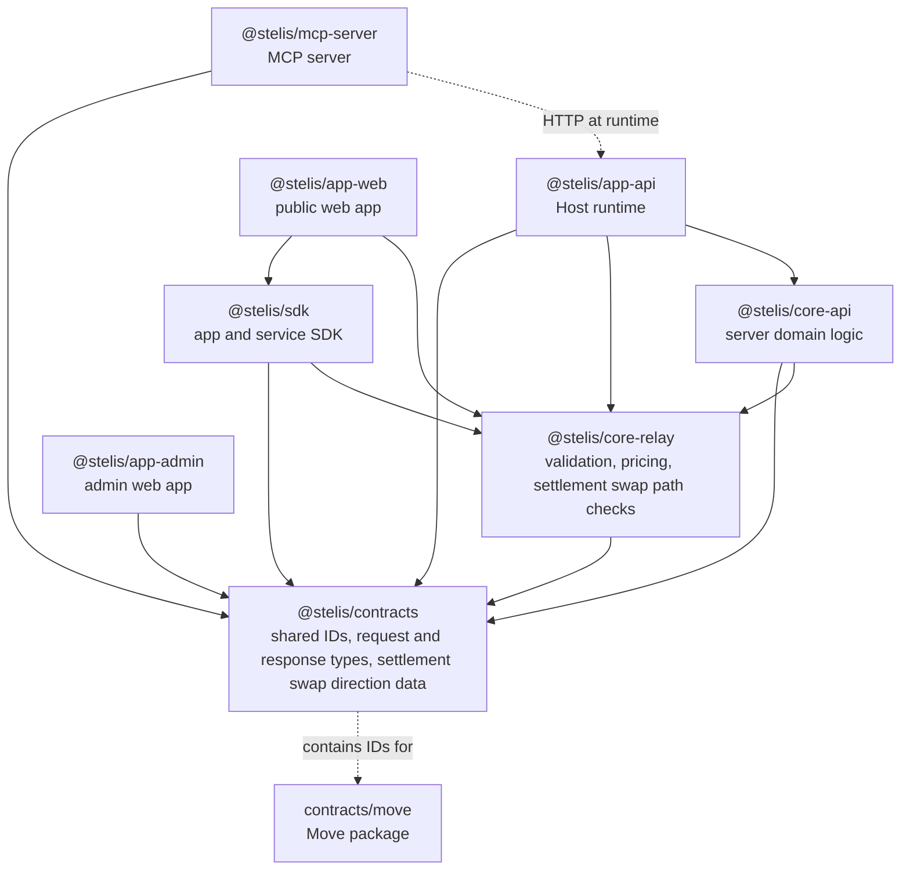

# Repository Structure

This document explains the package layout, product package policy, and dependency rules for this repository.

The repository uses npm workspaces for development. Product publishing and deployment are controlled by the final packages that users install, deploy, or run.

## Package Classes

| Class | Meaning |
| --- | --- |
| Published package | A package installed from npm by external users |
| Deployable package | A package deployed as a running service or static web app |
| Move package | The on-chain package under `packages/contracts/move` |
| Internal package | A private workspace package used to keep shared code in one place |

## Product Packages

| Package | Class | Audience | Role |
| --- | --- | --- | --- |
| `@stelis/sdk` | Published package | App and service developers | TypeScript SDK for sponsored transaction flows |
| `@stelis/mcp-server` | Published package | Agent runtimes and Model Context Protocol clients | Model Context Protocol (MCP) server for agent-facing transaction workflows |
| `@stelis/app-api` | Deployable package | Host operators | Host runtime for Relay API, auth, admin, and promotion HTTP APIs |
| `@stelis/app-web` | Deployable package | Evaluators and app developers | Public static web app for docs, status, and evaluation flows |
| `@stelis/app-admin` | Deployable package | Host operators | Static admin app |
| `packages/contracts/move` | Move package | Protocol deployers and auditors | On-chain settlement, vault, config, and event modules |

## Internal Packages

| Package | Role |
| --- | --- |
| `@stelis/contracts` | Contract IDs, shared request and response types, settlement swap direction data, and data shared with Move contracts |
| `@stelis/core-relay` | Transaction validation, Sui request/result identity binding, pricing, settlement swap path checks, and transaction-building helpers |
| `@stelis/core-api` | Server-side domain logic for prepare, sponsor, admin, promotion, stores, and abuse controls |

Internal packages are marked `private: true`. They are workspace boundaries, not public install targets.

## Workspace Layout

```text
stelis/
  packages/
    contracts/
      src/              # shared TypeScript contract data and types
      move/             # on-chain Move package
    core-relay/         # shared relay validation and pricing logic
    core-api/           # server-side domain logic
    sdk/                # published TypeScript SDK
    mcp-server/         # published MCP server
    app-api/            # deployable Host runtime
    app-web/            # deployable public web app
    app-admin/          # deployable admin web app
  docs/
    index.md
    repository-structure.md
    schemas/
    architecture/
  scripts/
```

## Dependency Direction



Important rules:

- `@stelis/sdk` and `@stelis/mcp-server` are sibling products. They must not import each other.
- `@stelis/mcp-server` calls a Stelis Host over HTTP and consumes current wire contracts from `@stelis/contracts` in source. Its published build bundles that private source-of-truth code and does not require `@stelis/contracts` at runtime. It does not import `@stelis/sdk`, `@stelis/core-api`, or `@stelis/app-api`.
- App packages depend on internal packages only when they are built inside this repository. The Host and public web app consume `@stelis/core-relay` directly for Sui request/result identity binding; they do not reach it through a convenience re-export from another product boundary.
- External user entry points are product packages, not internal packages.
- Do not add a new top-level package unless it is a product package or a durable internal package with clear ownership.

## Boundary Naming

Package boundary names use stable domain nouns and boundary-specific action verbs. The same concept keeps the same noun across packages, while each package uses a verb that matches its responsibility.

| Boundary | Naming rule |
| --- | --- |
| HTTP routes | Use route actions that match mounted API paths and request methods |
| `@stelis/core-api` | Use `handle*` for server-side domain handlers |
| `@stelis/sdk` | Use app-developer goals for public SDK APIs |
| `@stelis/mcp-server` | Use snake_case agent actions for MCP tool names |
| Move package | Use Move snake_case entry names |

Current cross-boundary names:

| Concept | Name |
| --- | --- |
| Promotion-funded sponsored execution | `PromotionSponsored` / `promotion_sponsored` |
| Sponsor slot refill, probe, and state upkeep | `SponsorOperations` |
| Request admission checks for sponsor slots | `SponsorAvailability` |
| Read snapshots | `Status` |
| Operation outputs | `Result` |
| Handler inputs | `Params` |
| Transport bodies | `Request` / `Response` |
| Extracted Programmable Transaction Block paths | `Trace` |

Public boundary names do not use generic words such as `Data`, `Payload`, `Info`, or `Ops`. Public docs and package exports contain only current names, without alternate wrappers or compatibility names.

## Public Exports

| Package | Public export paths | Notes |
| --- | --- | --- |
| `@stelis/sdk` | `.`, `./server` | Published SDK entry points |
| `@stelis/mcp-server` | `.` | Published MCP server entry point and CLI package |
| `@stelis/contracts` | `.` | Private workspace export |
| `@stelis/core-relay` | `.`, `./server`, `./browser` | Private workspace export used by SDK, API, and tests |
| `@stelis/core-api` | `.`, `./prepareConfig`, `./admin`, `./studio`, `./testing/studio`, `./observability` | Private workspace export used by the Host runtime and tests |

Do not add exports just for symmetry. Add an export only when a verified consumer needs it.

## Product Boundaries

### SDK

`@stelis/sdk` is for app and service developers. It owns the public TypeScript API for connecting to a Stelis relay, preparing sponsored transactions, submitting user-signed transactions, and verifying settlement events against backend-owned expected fields.

### MCP Server

`@stelis/mcp-server` is for agent clients. It exposes Stelis Host endpoints as MCP tools. It does not hold keys, sign transactions, or create arbitrary transaction content by itself. Callers provide transaction-kind bytes and user signatures.

### Host Runtime

`@stelis/app-api` is the deployable server. It mounts relay, auth, admin, and promotion routes. Server execution and store wiring belong here, while reusable domain logic belongs in `@stelis/core-api`.

### Web Apps

`@stelis/app-web` and `@stelis/app-admin` are deployable static web apps. They are private workspace packages because they are deployed, not installed as libraries.

### Move Package

`packages/contracts/move` is the on-chain package. TypeScript contract IDs and
shared data live in `@stelis/contracts`. The current Stelis deployment is
testnet-only, and testnet contract changes use fresh package deployments.
Consumers use only the current package interface and IDs; compatibility paths
for superseded testnet packages are not retained.

## Documentation Boundaries

| Document | Owns |
| --- | --- |
| [`README.md`](../README.md) | Public project entry point and product package navigation |
| [`docs/index.md`](./index.md) | Documentation map and reader navigation |
| `docs/repository-structure.md` | Package layout, product package policy, and dependency direction |
| `docs/api.md` | Mounted HTTP route groups and current request/response fields |
| `docs/integration.md` | SDK, MCP, and promotion integration flow |
| `docs/payment-platform.md` | Product terms and payment-flow responsibility split |
| `docs/invariants.md` | Contract and relay rules with invariant IDs |
| `docs/security.md` | Security boundaries visible in the current code |
| `docs/parameters.md` | Public constants and required environment variables |
| `docs/operations.md` | Host, Studio, sponsor, and admin operation notes |
| `docs/architecture.md` | Architecture map and topic navigation |
| Package README files | Package-local commands, environment variables, exports, and usage notes |

This documentation set includes only examples, scripts, and audit workflows that match files present in this repository.
