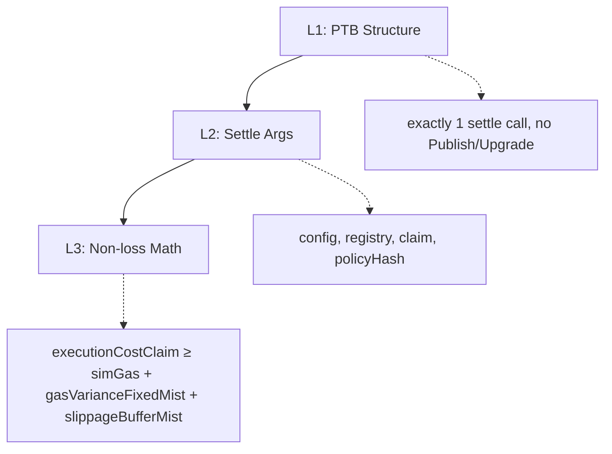

# @stelis/core-relay

Pure TypeScript relay validation and quote library - framework-independent.

> **Internal workspace — not published to npm.** This package is
> `"private": true` in the monorepo. App and service developers use
> `@stelis/sdk`, which bundles `@stelis/core-relay` into its published
> tarball (tsup `noExternal` + `dts.resolve`). Agent clients use
> `@stelis/mcp-server`. External consumers never install
> `@stelis/core-relay` directly.

- Built for: maintainers, reviewers, and internal developers working on validation, quote math, or relay helpers.
- Use for: transaction validation, quote math, and reusable relay calculation helpers.
- Not for: Host orchestration, server setup, Studio authentication utilities, or public integration onboarding.

> [!NOTE]
> Codes like `S-14`, `R-1` are invariant IDs defined in [invariants.md](../../docs/invariants.md)

## Purpose

Performs validation for user-supplied transaction-kind bytes and the final Host-built
Programmable Transaction Block (PTB):



> For full validation mapping, see [security.md](../../docs/security.md).  
> For cost formulas, see [economics-formal.md](../../docs/economics-formal.md).

Shared contract/data constants and cross-package request and response types live in `@stelis/contracts`.
Studio developer JWT decoding is a private `@stelis/core-api` concern and is not
exported by any `@stelis/core-relay` entrypoint.

Current Sui RPC simulation and Move-view calls run through this package's exact
operation gateways. `@stelis/core-api` owns the prepare/sponsor domain policy
that consumes those normalized results.

## When to Use

Use this package when you need:

- pure validation logic without a web framework
- quote and non-loss math as reusable TypeScript functions
- PTB normalization, validation helpers, and quote-side runtime helpers
- exact current Sui simulation, execution, effects, event, object, coin, and balance gateways

Use `@stelis/core-api` instead when you need:

- HTTP handlers
- prepare/sponsor dry-run orchestration and failure policy
- sponsor signing
- prepare/sponsor handler orchestration

## Installation

This workspace is `"private": true` and is consumed only through
npm workspaces. There is no standalone npm install target. The
code examples below target internal maintainers working on the
relay validation / quote layer; external consumers use
`@stelis/sdk` instead, which bundles the relevant helpers
directly.

## API

### Validation

```typescript
import {
  validateGenericSettlementTransaction,
  validateSettleArgs,
  validateNonlossSponsor,
} from '@stelis/core-relay';

// L1: final Host-built transaction structure
const l1 = validateGenericSettlementTransaction(finalTx, env);
// → { ok: true } | { ok: false, code: 'L1_NO_SETTLE' | 'L1_MULTIPLE_SETTLE' | ... }

// L2: settle arguments
const l2 = validateSettleArgs(settleArgs, onchainConfig, env);
// → { ok: true } | { ok: false, code: 'L2_WRONG_CONFIG' | 'L2_WRONG_RECIPIENT' | ... }

// L3: sponsor-time non-loss math (no `totalIn`; dust is enforced by on-chain S-3)
const l3 = validateNonlossSponsor(sponsorNonlossContext, onchainConfig);
// → { ok: true } | { ok: false, code: 'L3_NONLOSS_VIOLATION' | 'L3_GAS_BUDGET_EXCEEDED' | 'L3_SIM_GAS_OUT_OF_RANGE' }
```

### Gas Estimation

```typescript
import { computeExecutionCostClaim } from '@stelis/core-relay';

const estimate = computeExecutionCostClaim({
  computationCost: '8000000',
  storageCost: '2000000',
  storageRebate: '1000000',
});
// → { simGas, grossGas, gasVarianceFixedMist, slippageBufferMist, executionCostClaim }
```

### Constants

```typescript
import { MAX_FINAL_COMMANDS } from '@stelis/core-relay';

import {
  // credit-only
  SETTLE_WITH_CREDIT_FUNCTION, // 'settle_with_credit'
  // settlement swap direction
  SETTLE_FUNCTIONS, // Set<string> — L1 allowlist (5 entries)
  SETTLEMENT_SWAP_DIRECTION_FUNCTIONS, // Record<SettlementSwapDirection, { newUser, withVault }>
} from '@stelis/contracts';

// examples:
SETTLEMENT_SWAP_DIRECTION_FUNCTIONS.baseForQuote.newUser; // 'swap_and_settle_new_user_bfq'
SETTLEMENT_SWAP_DIRECTION_FUNCTIONS.baseForQuote.withVault; // 'swap_and_settle_with_vault_bfq'
SETTLEMENT_SWAP_DIRECTION_FUNCTIONS.quoteForBase.newUser; // 'swap_and_settle_new_user_qfb'
SETTLEMENT_SWAP_DIRECTION_FUNCTIONS.quoteForBase.withVault; // 'swap_and_settle_with_vault_qfb'
```

## L1 Validation Policy

For user-supplied transaction-kind bytes, see [User TransactionKind rules](../../docs/api.md#user-transactionkind-rules). The P1 rules reject settlement calls before the Host appends one. The L1 rules below validate the final Host-built transaction, which must contain exactly one allowed settlement call.

| Command                                         | Policy                                                           |
| ----------------------------------------------- | ---------------------------------------------------------------- |
| `{pkg}::settle::swap_and_settle_new_user_bfq`   | ✅ Exactly 1 required (settlement swap direction `baseForQuote`) |
| `{pkg}::settle::swap_and_settle_with_vault_bfq` | ✅ Exactly 1 required (settlement swap direction `baseForQuote`) |
| `{pkg}::settle::swap_and_settle_new_user_qfb`   | ✅ Exactly 1 required (settlement swap direction `quoteForBase`) |
| `{pkg}::settle::swap_and_settle_with_vault_qfb` | ✅ Exactly 1 required (settlement swap direction `quoteForBase`) |
| `{pkg}::settle::settle_with_credit`             | ✅ Exactly 1 required                                            |
| `{pkg}::settle::*` (other)                      | ❌ `L1_UNAUTHORIZED_STELIS_CALL`                                 |
| External package MoveCalls                      | ✅ Allowed (arbitrary)                                           |
| `Publish` / `Upgrade`                           | ❌ `L1_FORBIDDEN_COMMAND`                                        |
| Any command with `GasCoin` reference            | ❌ `L1_GASCOIN_FORBIDDEN`                                        |

## Error Codes

The validator implementations own when these codes are emitted;
`@stelis/contracts` owns the subset exposed through the current Host wire
contract. This table documents their current meanings and is not a second
runtime registry.

| Layer | Code                                     | Description                                                                                                                          |
| ----- | ---------------------------------------- | ------------------------------------------------------------------------------------------------------------------------------------ |
| P1    | `P1_TOO_MANY_COMMANDS`                   | User TransactionKind command count exceeds 11                                                                                        |
| P1    | `P1_GASCOIN_FORBIDDEN`                   | User TransactionKind references GasCoin                                                                                              |
| P1    | `P1_USER_SETTLE_FORBIDDEN`               | User TransactionKind calls a settlement entrypoint                                                                                   |
| P1    | `P1_UNAUTHORIZED_STELIS_CALL`            | User TransactionKind calls a Stelis function other than allowed `vault::withdraw`; settlement entries use `P1_USER_SETTLE_FORBIDDEN` |
| P1    | `P1_FORBIDDEN_COMMAND`                   | User TransactionKind contains Publish/Upgrade                                                                                        |
| P1    | `P1_SPONSOR_WITHDRAWAL_FORBIDDEN`        | User TransactionKind contains FundsWithdrawal(Sponsor)                                                                               |
| P1    | `UNACCOUNTABLE_WITHDRAWAL`               | User TransactionKind contains same-token FundsWithdrawal(Sender) that cannot be safely accounted                                     |
| L1    | `L1_NO_SETTLE`                           | No settle or swap_and_settle call found                                                                                              |
| L1    | `L1_MULTIPLE_SETTLE`                     | More than one allowed settlement entry call                                                                                          |
| L1    | `L1_FORBIDDEN_COMMAND`                   | Contains Publish/Upgrade                                                                                                             |
| L1    | `L1_UNAUTHORIZED_STELIS_CALL`            | Stelis package call other than an allowed settlement entry or `vault::withdraw`                                                      |
| L1    | `L1_TOO_MANY_COMMANDS`                   | Final command count exceeds 16                                                                                                       |
| L1    | `L1_GASCOIN_FORBIDDEN`                   | Command references GasCoin (S-15)                                                                                                    |
| L2    | `L2_WRONG_CONFIG`                        | Config object ID mismatch                                                                                                            |
| L2    | `L2_WRONG_REGISTRY`                      | VaultRegistry object ID mismatch                                                                                                     |
| L2    | `L2_WRONG_RECIPIENT`                     | settlement payout recipient address mismatch                                                                                         |
| L2    | `L2_EXCESSIVE_CLAIM`                     | executionCostClaim > maxClaimMist                                                                                                    |
| L2    | `L2_HOST_FEE_CAP`                        | quotedHostFeeMist > config.maxHostFeeMist                                                                                            |
| L2    | `L2_PROTOCOL_FEE_MISMATCH`               | expected_protocol_fee_mist does not match config                                                                                     |
| L2    | `L2_CONFIG_VERSION_MISMATCH`             | expected_config_version does not match config                                                                                        |
| L2    | `L2_CREDIT_SLIPPAGE_NONZERO`             | Credit-only settlement carries a non-zero slippage buffer                                                                            |
| L2    | `L2_SETTLEMENT_SWAP_PATH_INTEGRITY`      | Settlement swap path metadata is malformed                                                                                           |
| L2    | `L2_NO_SETTLEMENT_SWAP_PATHS_CONFIGURED` | No configured settlement swap paths are available                                                                                    |
| L2    | `L2_UNAUTHORIZED_SETTLEMENT_SWAP_PATH`   | Requested settlement swap path is not configured                                                                                     |
| L2    | `L2_POLICY_HASH_MISMATCH`                | Submitted policy hash does not match Host policy                                                                                     |
| L2    | `L2_ORDER_ID_HASH_MISMATCH`              | Submitted order ID hash does not match expected hash                                                                                 |
| L3    | `L3_NONLOSS_VIOLATION`                   | executionCostClaim < simGas + gasVarianceFixedMist + slippageBufferMist                                                              |
| L3    | `L3_GAS_BUDGET_EXCEEDED`                 | gasBudget > maxClaimMist                                                                                                             |
| L3    | `L3_SIM_GAS_OUT_OF_RANGE`                | simGas > maxClaimMist                                                                                                                |

For swap settlements, dust prevention (`totalIn < minSettleMist`) is not a sponsor-time L3 code. `totalIn` is a runtime value not visible at sponsor time, so the on-chain `S-3` (`ETotalInTooLow`) assert remains that path's dust defense and is reported as `SPONSOR_ONCHAIN_FAILED` if it fires. The Host planner applies the threshold before choosing credit-only settlement; `settle_with_credit` intentionally disables the on-chain `S-3` guard.

## Build & Test

```bash
npm run build --workspace=@stelis/core-relay
npm run test --workspace=@stelis/core-relay
```

## Typical Consumers

This package is meant to sit below Host applications.

Typical consumers:

- `@stelis/core-api`
- internal tooling that wants validation without serving HTTP
- test helpers that need the same quote and rule logic as production code
