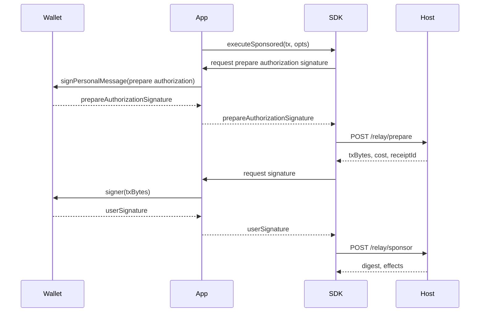
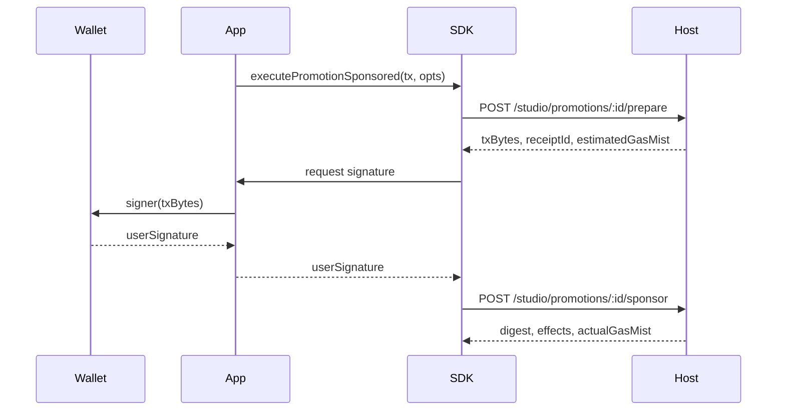

# @stelis/sdk

SDK for Sui apps that use sponsored transactions through a Host.

- Built for: app developers, service developers, and integration agents using an existing Host.
- Use for: `StelisSDK`, package-level TypeScript APIs, and links to integration, API, and demo docs.
- Not for: full HTTP field definitions, Host deployment procedures, Host operations policy, or wallet custody.

> [!NOTE]
> Codes like `S-10` are invariant IDs defined in [invariants.md](../../docs/invariants.md)
> `Host`, `Relay API`, `Admin app`, `Studio`, `Host execution role`, and `Host operator` are defined in [docs/payment-platform.md → Product Family Terms](../../docs/payment-platform.md#product-family-terms).
> PTB means Programmable Transaction Block, Sui's transaction-building format.

## Start Here

Use this README when you are integrating against an existing Host (with or without Studio mode enabled) and do **not** want to operate your own Host.

If your product lets users complete transactions without managing gas, this is the default entry path.
Start by connecting to an existing Host.
If your selected Host does not advertise the token your product needs, move to the `Studio` or `Host` path instead of treating another third-party Host as the normal solution.
Consume the shipped SDK as-is. Modifying the SDK, contracts, or Host/core source is not part of the normal integrator path.

- Problem fit:
  - your users execute without holding SUI
  - you want package-level integration instead of raw HTTP calls
  - you want `connect()` to discover Host capability through `supportedSettlementSwapPaths`
  - you are building game actions, commerce checkout, or an agent wallet flow on top of a Host

- Need to run your own Host? Start with [docs/getting-started.md](../../docs/getting-started.md).
- Need to call a deployed Host directly without the SDK? Start with [docs/api.md](../../docs/api.md).
- Need the transaction constraints enforced before prepare? Start with [docs/api.md → User TransactionKind rules](../../docs/api.md#user-transactionkind-rules).
- Integrating against the Studio promotion flow? Pair this README with [docs/payment-platform.md](../../docs/payment-platform.md).
- Operating a Host with Studio mode enabled? Use [docs/operations.md → Studio Mode Operations](../../docs/operations.md#studio-mode-operations).
- Need product-owned settlement token support because your selected Host is missing your token? Move to [docs/payment-platform.md](../../docs/payment-platform.md) and [docs/operations.md -> Settlement Token Onboarding Procedure](../../docs/operations.md#settlement-token-onboarding-procedure).
- Need an interactive browser flow? Use [packages/app-web](../app-web/README.md).

## Responsibility Split

| Boundary                    | Responsibility                                                                                                                                 |
| --------------------------- | ---------------------------------------------------------------------------------------------------------------------------------------------- |
| **You prepare**             | wallet bridge, prepare authorization signer, transaction signer, user-intent PTB, endpoint choice, and approval policy                          |
| **Stelis provides**         | the shipped `StelisSDK`, runtime capability discovery through `supportedSettlementSwapPaths`, and prepare/sponsor orchestration helpers                      |
| **Shared boundary**         | choose `settlementToken` from `supportedSettlementSwapPaths`, sign the prepare authorization message, sign the returned `txBytes`, and treat `receiptId` as single-use |
| **Out of scope for Stelis** | wallet custody, MCP runtime, agent autonomy, and human approval UX                                                                             |

> The SDK does not retry Host errors. It returns Host failures as `StelisApiException` or `StelisSponsoredError` with the Host-provided code, and retry/backoff policy belongs on your side. Capacity codes include `SPONSOR_CAPACITY_UNAVAILABLE`, `SPONSOR_REFILL_ACCOUNT_UNHEALTHY`, `PREPARE_OVERLOADED`, `NO_SPONSOR_SLOT`, and `LEASE_EXPIRED`. `ABUSE_BLOCKED` includes `retryAfterMs`; raw HTTP clients also receive `Retry-After` for `PREPARE_OVERLOADED`.
> Missing token support is resolved by the Host operator updating `packages/app-api/settlement-swap-paths.json` on a product-owned `Studio` or `Host` deployment, not by SDK customization.

## Purpose

This package is the public dApp-facing integration layer for Stelis.

Use it when you want to:

- estimate sponsored cost for a user action
- build and execute a sponsored flow through a Host
- compose external Move-based user flows and finish them with Stelis settlement
- consume the Relay API without depending on monorepo-internal helpers

## Supported Entry Points

The supported npm entry points are:

- `StelisSDK.connect()`
- `StelisSDK.executeSponsored()`
- `StelisSDK.executeSuiFirst()`
- `StelisSDK.estimateGas()`
- `StelisSDK.buildWithdrawPtb()` — build a vault withdrawal PTB
- `StelisSDK.prepareSponsored()` — advanced 2-step flow (prepare → sign → sponsor)
- `StelisSDK.executePromotionSponsored()` — promotion-specific execution (studio mode)
- `StelisSDK.preparePromotionSponsored()` — advanced 2-step promotion flow
- `StelisSDK.sponsorPromotionSponsored()` — submit signed promotion TX
- `StelisSponsoredError` — structured error for sponsored execution failures
- `StelisApiException` — HTTP-level API errors
- `StelisIntegrityError` — S-16 integrity verification failures
- `listAvailablePromotions()` — standalone server-to-server promotion discovery
- `getPromotionUserState()` — standalone server-to-server promotion detail
- `checkSettlementSwapPathLiquidity()` — DeepBook pool liquidity check
- `queryUserCredit()` — on-chain vault/credit lookup
- `canonicalizeTarget()` — R-10 allowedTargets hashing (browser-safe)
- `STELIS_CONTRACT_IDS`, `DEEPBOOK_IDS` — built-in on-chain contract IDs
- exported response, config, and promotion types

The server-only entry point `@stelis/sdk/server` exports:

- `verifySettleEventAgainstExpected()` — verify an on-chain `SettleEvent` against backend-owned expected fields
- `extractSettleEvents()` — extract decoded `SettleEvent` summaries for reconciliation scans
- `ExpectedSettleEventFields`, `VerifiedSettleEvent`, and `ExtractedSettleEventSummary`

## Documentation Handoff

After this README, continue in this order:

1. [docs/integration.md](../../docs/integration.md) for the generic relay prepare -> sign -> sponsor client flow
2. [docs/payment-platform.md](../../docs/payment-platform.md) for promotion-sponsored Studio flow
3. [docs/api.md](../../docs/api.md) for the current endpoint map, request fields, and response fields
4. [packages/app-web/README.md](../app-web/README.md) for the public docs/sandbox frontend

### Execution Flow

<!-- package-specific: SDK internal orchestration, not derived from docs/integration.md -->

**Generic Relay API flow** (`executeSponsored`) — generic sponsored via `/relay/prepare` and `/relay/sponsor`:



**Studio promotion flow** (`executePromotionSponsored`) — promotion-budgeted via `/studio/promotions/:id/prepare` and `/sponsor`:



## Installation

```bash
npm install @stelis/sdk
```

**Peer Dependency**: `@mysten/sui` ^1.0.0 || ^2.0.0

## Quick Start — StelisSDK (Recommended)

`StelisSDK.connect()` fetches Host config (`network`, `packageId`, `settlementPayoutRecipient`,
`supportedSettlementSwapPaths`) from `/relay/config`, and resolves contract addresses (`configId`,
`vaultRegistryId`, `deepbookPackageId`, `deepType`) from SDK built-in constants
(bundled at build time from the shared internal contract package).
`settlementPayoutRecipient` is the settlement payout recipient address for `executionCostClaim` plus the quoted host fee.

`supportedSettlementSwapPaths` contains one active settlement swap path per `settlementTokenType`.
SDK calls choose a settlement token with `settlementToken.type`; they do not send a pool ID or path ID.
If a token is absent from `supportedSettlementSwapPaths`, the SDK treats it as unsupported on that Host.
The Host operator can add new settlement swap paths via `packages/app-api/settlement-swap-paths.json` — see [operations.md -> Settlement Token Onboarding Procedure](../../docs/operations.md#settlement-token-onboarding-procedure).

```typescript
import { StelisSDK, STELIS_CONTRACT_IDS } from '@stelis/sdk';
import { SuiGrpcClient } from '@mysten/sui/grpc';

// 0. Create your own SuiGrpcClient.
const suiClient = new SuiGrpcClient({ network: 'testnet' });

// 1. Connect to a Host with package pinning (required for integrity protection).
// Contract IDs are built into @stelis/sdk (bundled from the shared internal contract package).
const sdk = await StelisSDK.connect('http://localhost:3200/relay', {
  pinnedPackageId: STELIS_CONTRACT_IDS.testnet?.packageId, // fail-closed if null
  requestTimeouts: {
    // Optional overrides (ms). Defaults are defined by StelisRequestTimeouts.
    sponsorMs: 25_000,
  },
});

console.log(sdk.network); // 'mainnet' | 'testnet'
console.log(sdk.config.packageId); // built-in constant bundled into @stelis/sdk (verified against Host-advertised packageId at connect)

const prepareAuthorizationSigner = async (messageBytes: Uint8Array) => {
  const { signature } = await wallet.signPersonalMessage({ message: messageBytes });
  return signature;
};
```

### Token Support Decision

Use this shortcut before you connect product-specific flows:

1. `connect('https://your-host.example.com/relay')` or call `GET /relay/config`.
2. If your token appears once in `supportedSettlementSwapPaths`, continue with `executeSponsored()`.
3. If your token is missing, treat that Host as unsupported right now.
4. Then move to the `Studio` or `Host` path for product-owned settlement token support, or ask that Host operator to update `packages/app-api/settlement-swap-paths.json` and restart.
5. If the Host returns `LEASE_EXPIRED`, re-run `/relay/prepare`; if it returns `ABUSE_BLOCKED`, back off on your side.

---

## Sponsored Execution

### `executeSponsored()` — One-liner (Recommended)

SDK handles everything: coin query → `swap_and_settle` (single MoveCall) → prepare → sign → sponsor.

```typescript
import { Transaction } from '@mysten/sui/transactions';

const tx = new Transaction();
// Arbitrary MoveCall — allowed alongside swap_and_settle_* by L1 validator
tx.moveCall({ target: '0xMyContract::module::function', arguments: [...] });

const result = await sdk.executeSponsored(tx, {
  client: suiClient,
  prepareAuthorizationSigner,
  signer: wallet.signTransaction,
  addr: userAddress,
  settlementToken: { type: DEEP_TYPE }, // amount auto-calculated from prepare cost + exchange rate
  orderId: 'invoice-2026-001', // optional: external reference for payment tracking
});
console.log(result.digest);
console.log(result.orderId); // echoed back if provided
```

### Cost Inspection

Use the `onGasEstimate` callback to display cost before the user signs:

```typescript
const result = await sdk.executeSponsored(tx, {
  client: suiClient,
  prepareAuthorizationSigner,
  signer: wallet.signTransaction,
  addr: userAddress,
  settlementToken: { type: DEEP_TYPE },
  onGasEstimate: (amount, amountHuman, symbol) => {
    showToast(`Gas cost: ${amountHuman} ${symbol}`);
  },
});
```

### `estimateGas()` — Show Cost Without Building PTB

```typescript
const est = await sdk.estimateGas(suiClient, {
  addr: userAddress,
  settlementToken: { type: DEEP_TYPE },
});
// est.amountHuman   → '3.120000' (display unit amount)
// est.displayUnit   → 'DEEP' or 'SUI' (depends on profile)
// est.suiAmountHuman → '0.0074'
// est.hasLiquidity  → true
// est.canSkipLiquidity → true when credit_general (no swap needed)
```

`settlementToken` is required.

### Programmatic Signer (Server or Agent Runtime)

If your runtime signs without a browser wallet, provide the SDK's `prepareAuthorizationSigner(messageBytes)` and `signer(txBytes)` functions directly.

```typescript
import { Ed25519Keypair } from '@mysten/sui/keypairs/ed25519';
import { fromBase64 } from '@mysten/sui/utils';

const keypair = Ed25519Keypair.fromSecretKey(process.env.AGENT_SECRET_KEY!);
const USDC_TYPE = '0x...::usdc::USDC';

const result = await sdk.executeSponsored(tx, {
  client: suiClient,
  addr: keypair.toSuiAddress(),
  settlementToken: { type: USDC_TYPE },
  prepareAuthorizationSigner: async (messageBytes: Uint8Array) => {
    const { signature } = await keypair.signPersonalMessage(messageBytes);
    return signature;
  },
  signer: async (txBytes: string) => {
    const { signature } = await keypair.signTransaction(fromBase64(txBytes));
    return signature;
  },
});
```

This keeps wallet custody, policy, and approval logic on your side while using the same prepare -> sign -> sponsor contract.

### Studio Endpoint

For promotion integrations, use `studioEndpoint: true` at connect time.
This is required for `executePromotionSponsored()` and related promotion methods.

```typescript
const sdk = await StelisSDK.connect('https://studio.myapp.dev/relay', {
  studioEndpoint: true, // required for promotion methods
  pinnedPackageId: STELIS_CONTRACT_IDS.testnet?.packageId,
});
```

> [!NOTE]
> `studioEndpoint: true` activates studio mode on the connected endpoint.
> Promotion methods (`executePromotionSponsored`, `preparePromotionSponsored`, `sponsorPromotionSponsored`) are rejected
> at call time if the SDK was not connected in studio mode.

### Promotion-Sponsored Execution

For promotion-specific flows, use `executePromotionSponsored()`. This uses dedicated
`/studio/promotions/:id/prepare` and `/studio/promotions/:id/sponsor` endpoints instead
of the generic sponsored path. No `settlementToken` is needed — the promotion budget covers gas.

```typescript
const sdk = await StelisSDK.connect('https://studio.myapp.dev/relay', {
  studioEndpoint: true,
});

const tx = new Transaction();
tx.moveCall({ target: '0xMyContract::module::action', arguments: [...] });

const result = await sdk.executePromotionSponsored(tx, {
  client: suiClient,
  signer: wallet.signTransaction,
  addr: userAddress,
  promotionId: 'promo_abc',
  developerJwt: 'eyJ...',  // issued by your developer backend
});
console.log(result.digest);
console.log(result.actualGasMist); // actual gas consumed from promotion budget
```

For advanced 2-step control:

```typescript
// Step 1: Prepare (includes defense-in-depth integrity check —
//   verifies the server did not modify your user commands)
const prepared = await sdk.preparePromotionSponsored(tx, {
  client: suiClient,
  promotionId: 'promo_abc',
  addr: userAddress,
  developerJwt: 'eyJ...',
});
// → { txBytes, receiptId, estimatedGasMist }
// Throws StelisIntegrityError if server tampered with user commands

// Step 2: Sign (wallet or programmatic)
const signature = await wallet.signTransaction(prepared.txBytes);

// Step 3: Sponsor
const result = await sdk.sponsorPromotionSponsored({
  promotionId: 'promo_abc',
  receiptId: prepared.receiptId,
  txBytes: prepared.txBytes,
  userSignature: signature,
  developerJwt: 'eyJ...',
});
// → { digest, effects, actualGasMist }
```

> [!IMPORTANT]
> `executePromotionSponsored()` requires `studioEndpoint: true` at connect time.
> The promotion TX must contain only `MoveCall` commands. Non-MoveCall commands
> (`SplitCoins`, `TransferObjects`, etc.) are rejected by the promotion handler.

### Server-to-Server Promotion Discovery

For server-side integration (not browser), use the standalone discovery helpers:

```typescript
import { listAvailablePromotions, getPromotionUserState } from '@stelis/sdk';

// List all promotions visible to a user
const { promotions } = await listAvailablePromotions(
  'https://studio.myapp.dev',
  'developer-jwt-for-user-123',
);

// Get detailed promotion state for a specific user
const detail = await getPromotionUserState(
  'https://studio.myapp.dev',
  'promo_abc',
  'developer-jwt-for-user-123',
);
```

> These helpers use developer JWT authentication and do not require
> a `StelisSDK` instance. They are designed for server-to-server flows.

### Server Settlement Verification

For backend fulfillment, verify the final digest against the application values you expected when preparing the transaction. The helper requires expected fields; a `SettleEvent` by itself is not treated as application payment completion. The example assumes your backend retained the `receiptId` and prepare cost from a two-step prepare/sponsor flow.

```typescript
import { verifySettleEventAgainstExpected } from '@stelis/sdk/server';

const settlement = await verifySettleEventAgainstExpected(
  suiClient,
  sponsorDigest,
  sdk.config.packageId,
  {
    receiptId,
    user: userAddress,
    orderId: 'invoice-2026-001',
    executionCostClaimMist: prepared.cost.executionCostClaim,
    quotedHostFeeMist: prepared.cost.quotedHostFee,
    protocolFeeMist: prepared.cost.protocolFee,
  },
);

console.log(settlement.orderIdHash);
```

Use `extractSettleEvents()` from `@stelis/sdk/server` for reconciliation scans only. It extracts event summaries and does not compare them with application-owned expected values.

---

## External PTB Composition

Stelis is designed as a general gas abstraction layer for Sui PTBs.
The `Transaction` you pass into `executeSponsored()` can already
contain external Move calls. Stelis then appends the final settlement step, prices
the sponsorship, and runs the Host-sponsored flow.

This means Stelis is not tied to a single payment protocol or app contract.
Sui Payment Kit is one representative example of an external Move-based flow that
can be composed before Stelis settlement.

### Using Stelis With Sui Payment Kit

Sui Payment Kit (`@mysten/payment-kit`) is Mysten's payment SDK for Sui.
Use it to build the payment portion of the PTB.
Use Stelis to add the sponsored settlement and sponsor flow afterward.
The Stelis repository does not ship `@mysten/payment-kit`; this section is an optional composition example.

For shared PTB composition, prefer Payment Kit `client.paymentKit.calls.*` methods.
The `client.paymentKit.tx.*` methods create standalone ready-to-sign transactions,
which is not the right shape when Stelis still needs to append settlement to the
same `Transaction`.

Recommended flow:

1. determine the item price in the settlement token
2. build Payment Kit payment commands first on the same `Transaction`
3. call `stelisSdk.executeSponsored()` on that in-progress transaction
4. the SDK internally prepares, signs, and sponsors the combined PTB

Example:

```typescript
import { SuiGrpcClient } from '@mysten/sui/grpc';
import { Transaction } from '@mysten/sui/transactions';
import { paymentKit } from '@mysten/payment-kit';
import { StelisSDK, STELIS_CONTRACT_IDS } from '@stelis/sdk';

const client = new SuiGrpcClient({
  network: 'testnet',
  baseUrl: 'https://fullnode.testnet.sui.io:443',
}).$extend(paymentKit());

const stelis = await StelisSDK.connect('http://localhost:3200/relay', {
  pinnedPackageId: STELIS_CONTRACT_IDS.testnet?.packageId,
});

const userAddress = '0x...';
const receiverAddress = '0x...';
const USDC_TYPE = '0x...::usdc::USDC';

const itemPriceHuman = '100.00';
const itemPriceSmallest = 100_000_000; // 100.00 USDC (6 decimals)

const tx = new Transaction();
tx.add(
  client.paymentKit.calls.processEphemeralPayment({
    nonce: crypto.randomUUID(),
    coinType: USDC_TYPE,
    amount: itemPriceSmallest,
    receiver: receiverAddress,
    sender: userAddress,
  }),
);

const result = await stelis.executeSponsored(tx, {
  client,
  addr: userAddress,
  settlementToken: { type: USDC_TYPE },
  prepareAuthorizationSigner,
  signer: wallet.signTransaction,
  onGasEstimate: (amount, amountHuman) => {
    console.log(`Item price: ${itemPriceHuman} USDC`);
    console.log(`Estimated gas: ${amountHuman} SUI`);
  },
});

console.log(`Digest: ${result.digest}`);
```

For the simplest UX, use the same token for the item price and the Stelis settlement token.
That keeps the user-facing breakdown straightforward:

- `Item price: 100.00 USDC`
- `Estimated gas: 0.50 USDC`
- `Estimated total: 100.50 USDC`

Use `onGasEstimate` callback for pre-sign cost display.
`estimateGas()` is still useful as an early estimate, but the stronger number is
the one produced after the payment commands are already inside the PTB.

If you need to pre-split the same token for another action plus gas, build
the split within the `Transaction` before calling `executeSponsored()`.

Same-token payment plus gas is the recommended product path, but it is not the
only one. Different-token payment or vault-credit settlement remain valid
advanced flows.

Important constraints still apply:

- the transaction passed to `executeSponsored()` must not contain a Stelis settlement call; the SDK and Host append exactly one settlement call later
- `publish` and `upgrade` commands from any package are still forbidden in sponsored flows
- user-controlled arguments must not reference `GasCoin`
- `FundsWithdrawal(Sponsor)` is forbidden, and same-token `FundsWithdrawal(Sender)` is handled by the Host's settlement-token funding rules
- do not modify PTB after SDK takes over execution

For the complete constraint list, see [docs/api.md → User TransactionKind rules](../../docs/api.md#user-transactionkind-rules).

Stelis does not treat Payment Kit as a special protocol dependency.
Payment Kit is one example of the broader rule: external Move-based flows can be
composed first, and Stelis can finish the same PTB with sponsored settlement.

---

## Direct SUI Execution (Auto-Fallback)

### `executeSuiFirst()` — Use SUI if Sufficient, Else Sponsored

If the user holds enough SUI to cover estimated gas, executes directly without sponsored execution.
Otherwise, automatically falls back to `executeSponsored()`.

```typescript
const result = await sdk.executeSuiFirst(tx, {
  client: suiGrpcClient,
  prepareAuthorizationSigner,
  signer: wallet.signTransaction,
  addr: userAddress,
  settlementToken: { type: DEEP_TYPE }, // used only if sponsored execution is selected
});

console.log(result.path); // 'sui' | 'sponsored' (for debug/tracing)
console.log(result.digest);
console.log(result.orderId); // echoed only on sponsored path, undefined for direct SUI
```

**Constraints:**

- `tx` must not have gas fields preset (`setGasPayment`, `setGasBudget`, `setGasOwner`, `setGasPrice` throw)
- Gas budget is computed from `simulateTransaction` + `DEFAULT_GAS_MARGIN_BPS`
- Infra failures (`network`, `timeout`, `grpc`) trigger best-effort `executeSponsored` fallback
- Deterministic failures (simulation abort, no gasUsed) throw immediately

> [!NOTE]
> `path: 'sui' | 'sponsored'` is for debug/tracing only. Do not branch on it.
> Best-effort fallback can also fail if the client node itself is down.

---

## Monorepo-Only PTB Builders

Low-level PTB builders (`buildSwapAndSettlePtb`, `buildSettleWithCreditPtb`)
live in the monorepo source at `packages/core-relay/src/ptb/builders.ts` and are re-exported from `@stelis/core-relay/browser` for internal/server-side use. They are **not exported** from the `@stelis/sdk` npm entrypoint. `buildWithdrawPtb` is available via `StelisSDK.buildWithdrawPtb()`.

For npm consumers, the stable public path remains:

- `StelisSDK.executeSponsored()` for high-level execution
- `StelisSDK.executeSuiFirst()` for SUI-first with sponsored fallback
- `StelisSDK.prepareSponsored()` for advanced 2-step flows with custom sponsor handling

---

> [!NOTE]
> `StelisClient` is internal to the SDK. Use `StelisSDK.executeSponsored()` or
> `StelisSDK.executeSuiFirst()` instead.

## Type Exports

```typescript
import type {
  StelisConnectOptions,
  StelisRequestTimeouts,
  ExecuteSponsoredOptions,
  ExecuteSponsoredResult,
  GasEstimateResult,
  ExecuteSuiFirstResult,
  RelayConfigResponse, // /relay/config response: network, packageId, settlementPayoutRecipient, supportedSettlementSwapPaths, quotedHostFeeMist, protocolFlatFeeMist, integrityPolicyVersion
  SingleHopSettlementSwapPath, // settlement swap path config (1-hop only)
  DeepBookPoolHop, // config for a single pool hop
  PrepareResponse,
  SponsorResponse,
  SettleProfile,
  PrepareSponsoredOptions, // options for 2-step prepareSponsored()
  PrepareSponsoredResult, // result of prepareSponsored() — includes policyHash, profile
  // Promotion types
  ExecutePromotionSponsoredOptions,
  ExecutePromotionSponsoredResult,
  PromotionPrepareResponse,
  PromotionSponsorResponse,
} from '@stelis/sdk';

import type {
  ExpectedSettleEventFields,
  VerifiedSettleEvent,
  ExtractedSettleEventSummary,
} from '@stelis/sdk/server';
```

## Build & Test

```bash
npm run build --workspace=@stelis/sdk
npm run test --workspace=@stelis/sdk
```

## When to Use This Package

Choose `@stelis/sdk` when:

- you are integrating Stelis into a dApp
- you want the sponsored execution flow handled for you
- you do not want to maintain settlement PTB assembly yourself

Choose monorepo source helpers instead when:

- you are working inside this repository
- you need internal PTB builder access that is not part of the npm contract

---

## Error Handling

### Settle Contract Errors (100–110)

> Source: `packages/contracts/move/sources/settle.move`

| Code | Constant                 | Description                                                                         |
| ---- | ------------------------ | ----------------------------------------------------------------------------------- |
| 100  | `EPaused`                | Settlement is paused by admin                                                       |
| 101  | `EClaimTooHigh`          | execution cost claim exceeds maximum allowed                                               |
| 102  | `ETotalInTooLow`         | SUI from swap below settlement minimum (swap amount too small or no pool liquidity) |
| 103  | `EInsufficientFunds`     | Not enough funds for execution cost claim + fees                                           |
| 104  | `EInvalidReceiptId`      | Receipt ID invalid or malformed                                                     |
| 105  | `EInvalidPolicyHash`     | Policy hash mismatch                                                                |
| 106  | `EConfigVersionMismatch` | L2 tamper detection: config version mismatch                                        |
| 107  | `EProtocolFeeMismatch`   | L2 tamper detection: protocol fee mismatch                                          |
| 108  | `EHostFeeCapExceeded` | L2 tamper detection: host fee cap exceeded                                       |
| 109  | `EInvalidOrderIdHash`    | L2 tamper detection: order ID hash invalid                                          |
| 110  | `ESpreadTooWide`         | Spread guard: bid-ask spread exceeds max or book is empty/crossed                   |

### Vault Errors (0–4)

> Source: `packages/contracts/move/sources/vault.move`

| Code | Constant                  | Description                                 |
| ---- | ------------------------- | ------------------------------------------- |
| 0    | `EInsufficientBalance`    | Vault credit insufficient                   |
| 1    | `EReplayNonce`            | Duplicate nonce (already processed)         |
| 2    | `EVaultAlreadyRegistered` | Vault already exists for this address       |
| 3    | `EVaultNotRegistered`     | No vault found for this address             |
| 4    | `EVaultMismatch`          | Vault object doesn't match registered vault |

### Gas Auto-Calculation

When `settlementToken.amount` is omitted, the SDK auto-calculates swap amount:

1. **Needed SUI** = `executionCostClaim + fee + protocolFee` (from the prepare response)
2. **Payment amount** = `neededSuiMist × FLOAT_SCALING(1e9) / midPrice × margin`
   - `midPrice` is DeepBook's raw u64: `quote_smallest × 1e9 / base_smallest`
   - `baseForQuote` (e.g. DEEP→SUI): `microDEEP = neededMist × 1e9 / midPrice`
3. **Direction-aware book constraints**
   - `baseForQuote`: apply `minSize` + `lotSize` directly to payment input.
   - `quoteForBase`: convert first-hop `minSize` (base units) to quote input via
     `minQuote = ceil(ceil(minSize × hop1MidPrice / 1e9) × 1.15)`.

Surplus SUI is stored in the user's vault as credit and automatically
deducted in subsequent transactions.

---

## Settlement Swap Path Liquidity Check

### `checkSettlementSwapPathLiquidity()` — Pre-flight Liquidity Verification

Performs a mid_price query to verify active bid+ask orders exist.
`mid_price > 0` is a reliable indicator: DeepBook only returns a non-zero
value when both bid and ask orders are present in the book.
(`coin::zero` causes simulation to fail regardless of DeepBook pool state, so
settlement swap path liquidity is checked via mid-price query instead.)

```typescript
import { checkSettlementSwapPathLiquidity } from '@stelis/sdk';

const status = await checkSettlementSwapPathLiquidity(
  suiClient,
  deepbookPkgId,
  settlementSwapPath,
);
// status.hasLiquidity  → boolean
// status.status        → 'ok' | 'no_orders'
// status.midPrice      → JSON-safe display number, or null if outside safe range
// status.midPriceRaw   → exact raw DeepBook mid_price (FLOAT_SCALING=1e9)
// status.priceDisplay  → exact rounded display string, e.g. '0.027000'
// status.priceHuman    → approximate display number
// status.label         → 'DEEP/SUI'
```

| Status      | Meaning                                 |
| ----------- | --------------------------------------- |
| `ok`        | Settlement swap path active, swaps fill |
| `no_orders` | No bid/ask orders exist (mid_price = 0) |

---

## Next Documents

- [docs/integration.md](../../docs/integration.md) — client-side prepare -> sign -> sponsor flow
- [docs/api.md](../../docs/api.md) — current relay and studio route reference
- [packages/app-web/README.md](../app-web/README.md) — public docs UI, sandbox, and playground
